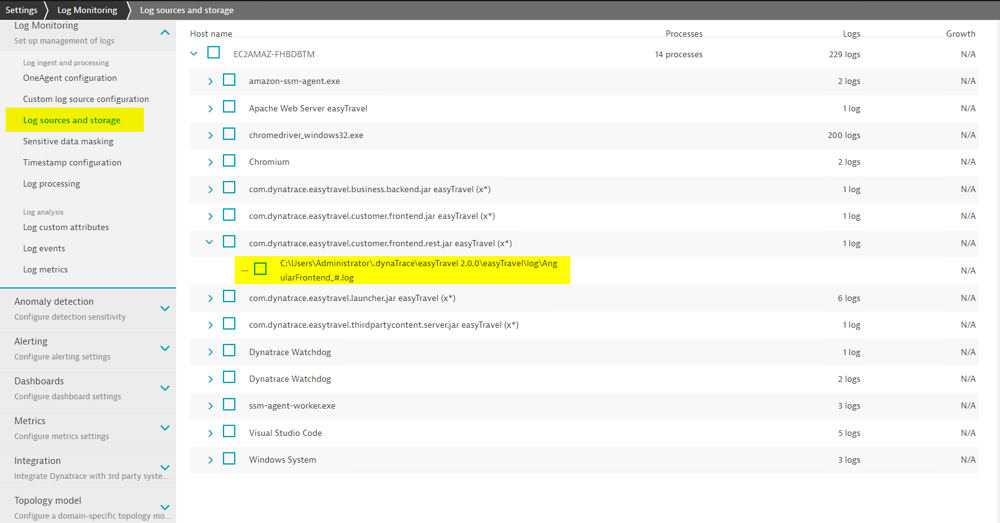
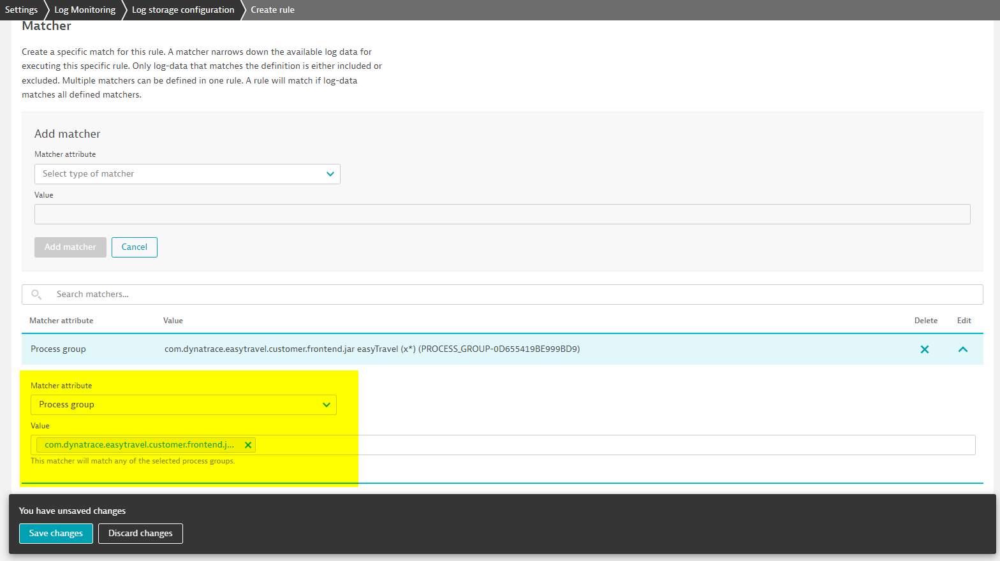

# 3.1 OneAgent

Enabling OneAgent log ingestion is a 2 step process:
1. OneAgent log discovery
2. Enable Log Storage on Server side.
   
   OneAgent (<1.243) & Dynatrace Server (<1.252) - [Log sources and storage](https://www.dynatrace.com/support/help/how-to-use-dynatrace/log-monitoring/acquire-log-data/add-log-files-sources-v2)

   OneAgent (>=1.243) & Dynatrace Server (>=1.252) - [Log storage configuration](https://www.dynatrace.com/support/help/shortlink/log-monitoring-log-storage)
    
## Log Discovery

OneAgent log discovery can happen 2 ways:
1. Autodiscovery
2. Manually add log files

### Autodiscovery

Autodiscovery is the process by which Dynatrace automatically discovers log files. 

See [Default autodiscovery](https://www.dynatrace.com/support/help/shortlink/log-monitoring-auto-discovery-v2#default-autodiscovery) for files autodiscovered by OneAgent out of the box. 
> Here is a [checklist-oneagent-auto-discovery](checklist-oneagent-auto-discovery.md) checklist you can use to see if a log file will be autodiscovered.

Other useful info:
- [Limitations](https://www.dynatrace.com/support/help/shortlink/log-monitoring-auto-discovery-v2#limitations-for-detected-files)
- [Turn off log autodiscovery](https://www.dynatrace.com/support/help/shortlink/log-monitoring-auto-discovery-v2#turn-off-log-autodiscovery)

### Manually add log files

Log files that are not auto discovered by OneAgent can be added manually for ingestion. The setup steps will be different based on your OneAgent and Server version. Please checkout one of below documents depending on your OneAgent and Server versions.
- OneAgent (<1.251) & Dynatrace Server (<1.254) - [Add log files manually](https://www.dynatrace.com/support/help/shortlink/log-monitoring-add-log-files-v2)
- OneAgent (>=1.251) & Dynatrace Server (>=1.254) - [Custom log source](https://www.dynatrace.com/support/help/shortlink/log-monitoring-custom-source)

There are [multiple advantages](https://www.dynatrace.com/support/help/shortlink/log-monitoring-custom-source#clscadvantages) to the newer version, but the main advantage that really stands out is the ability to specify a log file against the host and not have to mandatorily tie it to a running Process/ProcessGroup.

> There are multiple file name/path conditions that must be satisfied for manually added log file ingestion. Here is a [checklist-oneagent-manually-add-log-files](checklist-oneagent-manually-add-log-files.md) checklist to make sure OneAgent will ingest the file.

## Log Storage

Logs can be auto discovered or manually added, but the log data is not streamed/stored (ingested) in Dynatrace unless the Log Storage configuration is done.

Depending on your OneAgent and Server version, the configuration steps will vary. Please follow respective docs based on your environment.
- OneAgent (<1.243) & Dynatrace Server (<1.252) - [Log sources and storage](https://www.dynatrace.com/support/help/how-to-use-dynatrace/log-monitoring/acquire-log-data/add-log-files-sources-v2)
- OneAgent (>=1.243) & Dynatrace Server (>=1.252) - [Log storage configuration](https://www.dynatrace.com/support/help/shortlink/log-monitoring-log-storage)

The major difference between older and newer versions: 
- Older 'Log sources and storage' view shows the list of auto discovered logs with a check box to enable storage, but the new 'Log storage configuration' view does it differently. 'Log storage configuration' requires `matcher rules` defined. First screenshot shows the older way and second screenshot shows a matcher rule that would enable storage for the highlighted log from first screenshot.

  After upgrading to 'Log Storage Configuration' if there is a requirement to view the log files that are auto discovered by OneAgents , it can be seen in OneAgent log file (may have to scroll through to see the different files):

  Windows: `C:\ProgramData\dynatrace\oneagent\log\loganalytics\oneagent-logmon-detailed.log`

  Linux: `/var/log/dynatrace/oneagent/log/loganalytics/oneagent-logmon-detailed.log`

- 'Log Storage Configuration' allows defining rules that affects multiple hosts instead of having to enable logs by Host or ProcessGroup.

- 'Log Storage Configuration' allows log ingestion based on content. The filtering is done at OneAgent side and therefore helps save DDUs by not sending non-critical data like 'INFO' logs into Dynatrace.

## Activities

Visit below pages to view and complete respective demo activity:
1. [activity-setup-a-lab-environment](activity-setup-a-lab-environment.md)
2. [activity-log-ingestion-autodiscovery](activity-log-ingestion-autodiscovery.md)
3. [activity-log-ingestion-manually added files](activity-log-ingestion-manually%20added%20files.md)

 

### Next: [3.2-cloud-providers](3.2-cloud-providers.md)

### Previous: [3-log-ingestion](3-log-ingestion.md)

### Section home: [3-log-ingestion](3-log-ingestion.md)