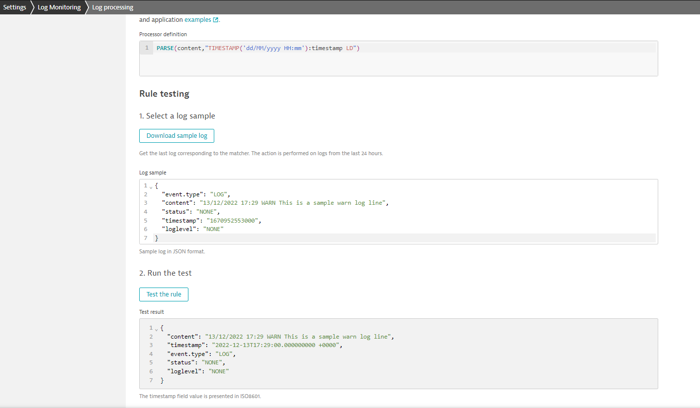

# 4.1 Processor Rule Definition

The purpose of the `processor rule` is to reshape a log entry into required format. This could be for better understanding (by parsing value from a log to existing or new fields), efficient filtering or data extraction.

The processor rule action can be broken down into a couple of steps:
1. Match a certain part of the log line
2. Assign the value to a field (existing or new)

### Example

In the below log line, timestamp is not in a format supported by Dynatrace out-of-the box. Therefore we have to create a processing rule to extract the time from the line and assign it to the `timestamp` field.

```log
08/09/2022 11:00 WARN This is a sample warn log line
```

Processing rule:

```rule
PARSE(content,"TIMESTAMP('dd/MM/yyyy HH:mm'):timestamp LD")
```

Here is break down of the processing rule:
- `PARSE(content, ...)`: This initial part tells Dynatrace that it needs to parse the log content in the Dynatrace structured log `content` field. 
- `"TIMESTAMP('dd/MM/yyyy HH:mm')"`: This part tells Dynatrace the format of the custom timestamp. [Time and Date format doc](https://www.dynatrace.com/support/help/how-to-use-dynatrace/dynatrace-pattern-language/log-processing-time-date)
- `:timestamp"`: This part tells Dynatrace to assign the value captured to the `timestamp` field.
- ` LD`: LD is Line Data. This basically tells Dynatrace to match any content that follows.

This way we have specified a parsing rule that matches the entire line, captures the timestamp value and assigns it into `timestamp` field. The result after parsing will look like below:

```log
{
  "content": "08/09/2022 11:00 WARN This is a sample warn log line",
  "timestamp": "2022-09-08T11:00:00.000000000 +0000"
}
```



Let's now modify the rule to capture both `timestamp` and `loglevel`.

```log
PARSE(content,"TIMESTAMP('dd/MM/yyyy HH:mm'):timestamp SPACE STRING:loglevel LD")
```

- `SPACE`: This part tells Dynatrace there is a space after time stamp value
- `STRING:loglevel`: This part tells Dynatrace to capture the string immediately following the space and assign it to `loglevel` field
- `LD`: Match the rest of the line

The result will now look like below:

```log
{
  "content": "08/09/2022 11:00 WARN This is a sample warn log line",
  "timestamp": "2022-09-08T11:00:00.000000000 +0000",
  "loglevel": "WARN"
}
```

Next:
- Adding new fields
- Extracting a numeric value
