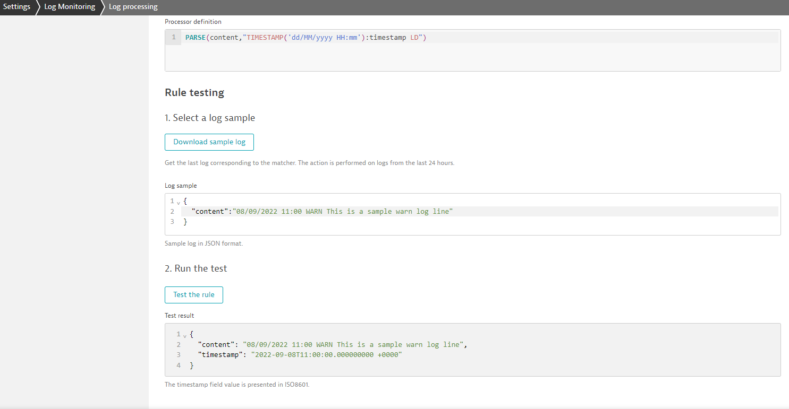
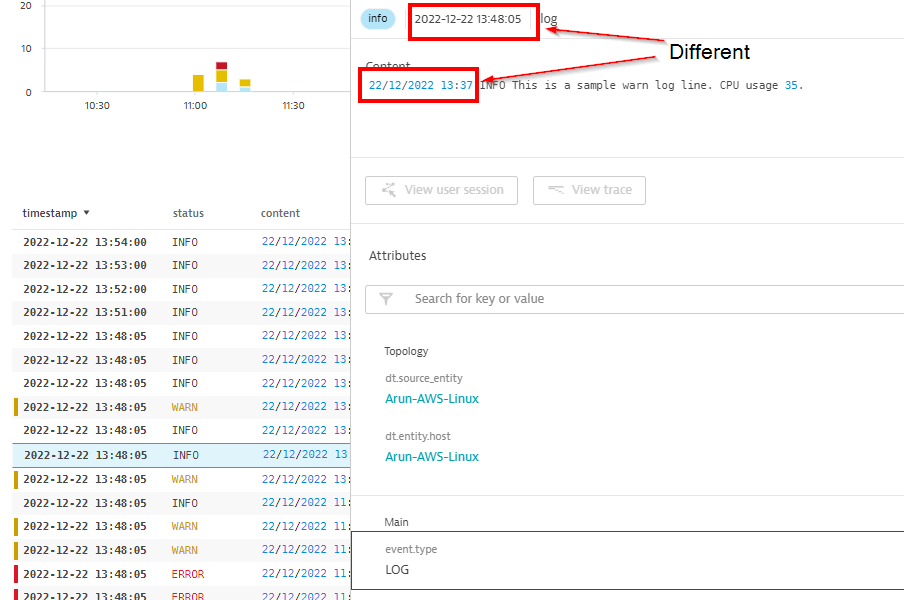
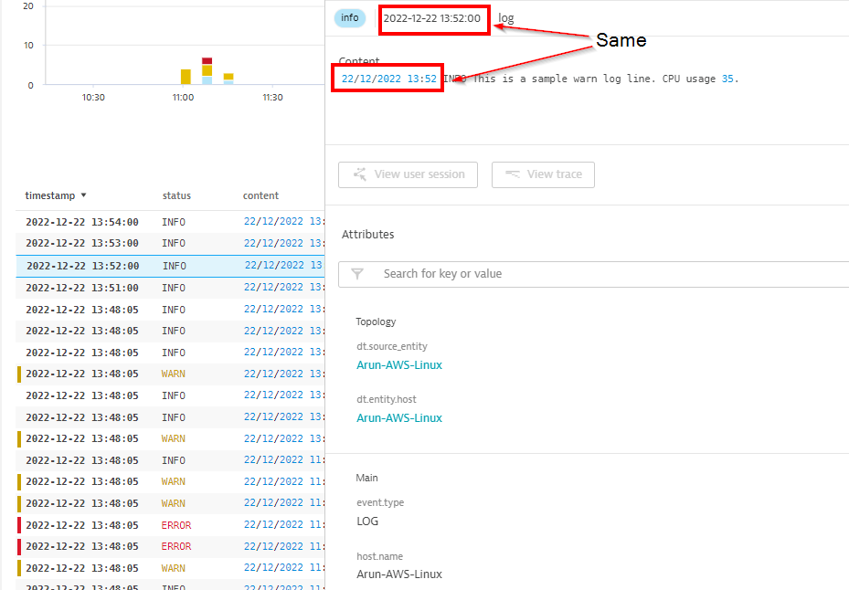

# 4.1 Processor Rule Definition


The purpose of the `processor rule` is to reshape a log entry into required format. This could be for better understanding, efficient filtering or data extraction.

The processor rule action can be broken down into 2 steps:
1. Match part(s) of the log line
2. Assign the value(s) to a field (existing or new)

Let me explain with an example:

### Example 1:

In the below log line, timestamp is not in a format supported by Dynatrace out-of-the box. Therefore we can create a processing rule to extract the time from the log line and assign it to the `timestamp` field.

Original log line:
```log
08/09/2022 11:00 WARN This is a sample warn log line. CPU usage 50.
```

Dynatrace automatically coverts this line into Dynatrace's structured log format once it is in Dynatrace:
```json
{
  "event.type": "LOG",
  "content": "13/12/2022 17:29 WARN This is a sample warn log line. CPU usage 50.",
  "status": "NONE",  
  "timestamp": "1670952553000",
  "loglevel": "NONE",
  "dt.entity.process_group": "PROCESS_GROUP-4ED515623E1C0F5C",
  "dt.entity.process_group_instance": "PROCESS_GROUP_INSTANCE-EADFAC768A7332A3",
  "log.source": "/var/log/messages",
  "dt.host_group.id": "linux",
  "dt.entity.host": "HOST-23DFA6FB3EC993F0"
}
```

To keep the explanation simple, lets exclude some fields and assume the log looks like below:
```json
{
  "event.type": "LOG",
  "content": "13/12/2022 17:29 WARN This is a sample warn log line. CPU usage 50.",
  "status": "NONE",  
  "timestamp": "1670952553000",
  "loglevel": "NONE"  
}
```

Here in the example you can see that Dynatrace has assigned a `timestamp` value for the entry. As the log does not have a supported timestamp format, Dynatrace assigns the ingestion time as the `timestamp`.

The Processing rule to assign the `timestamp` from the log line will look like below:

```parse
PARSE(content,"TIMESTAMP('dd/MM/yyyy HH:mm'):timestamp LD")
```

Here is a break down of the processing rule:
- `PARSE(content, ...)`: This initial part tells Dynatrace that it needs to parse the log content in the Dynatrace structured log `content` field. 
- `"TIMESTAMP('dd/MM/yyyy HH:mm')"`: This part tells Dynatrace the format of the custom timestamp. [Time and Date format doc](https://www.dynatrace.com/support/help/how-to-use-dynatrace/dynatrace-pattern-language/log-processing-time-date)
- `:timestamp"`: This part tells Dynatrace to assign the value captured by the previous step to the `timestamp` field.
- ` LD`: LD stands for Line Data. This basically tells Dynatrace to match any content that follows.

This way we have specified a parsing rule that matches the entire line, captures the timestamp value and assigns it to `timestamp` field. The result after parsing will look like below:

```json
{
  "event.type": "LOG",
  "content": "13/12/2022 17:29 WARN This is a sample warn log line. CPU usage 50.",
  "status": "NONE",  
  "timestamp": "2022-12-13T17:00:00.000000000 +0000",
  "loglevel": "NONE"  
}
```



<p align="center">Image 4.1 Log processing rule </p>
Before and After parsing log lines.


<p align="center">Image 4.2 Log line before log processing </p>


<p align="center">Image 4.3 Log line after log processing </p>

> Want to try this and more examples hands-on? See Activity: [activity-processor-rule-definition](activities/activity-processor-rule-definition.md) to setup and follow along (Recommended).


## Log parsing language

The language used for Dynatrace log parsing is [Dynatrace Pattern Language](https://www.dynatrace.com/support/help/shortlink/dpl-dynatrace-pattern-language-hub). Please checkout the  doc for help with writing advanced processing rules. 

NOTE: Logs powered by Grail has the capability to parse logs in-line during a log search. This in-line parsing (which we will be discussing this later) is done using [Dynatrace Query Language](https://www.dynatrace.com/support/help/shortlink/dql-dynatrace-query-language-hub)

Some common parameters:
- `LD` - Line Data. Matches all characters until an end is specified 
- `SPACE` - Match a single space
- `STRING` - Match a string
- `UPPER` - Match an upper case string
- `LOWER` - Match a lower case string
- `INT` - Match integer value
- `FLOAT` - Match float value
- `?` - Optional. Used with other parameters
	- Example: `SPACE?` - Optional space
- `CPU Usage` - Match literal value 'CPU Usage'
- `('user'| 'User')` - Match literal value 'user' or 'User'
- `IPADDR` - Match IP Address
- `PARSE(content, "JSON{STRING:message}(flat=true)")` - Parse flat (one liner) JSON for further processing
- `MM` - Month in numeric format. E.g.: 01
- `MMM` - Month in short text format. E.g.: Jan
- `MMMM` - Month in long format. E.g.: January

> Also available for reference as help sheet. See [help-sheet-log-parsing](help-sheets/help-sheet-log-parsing.md)


> Recommended: Try all the examples in Dynatrace [log processing examples](https://www.dynatrace.com/support/help/shortlink/log-monitoring-log-processing-examples) doc

<br/>

### Next: [5-log-data-analytics](5-log-data-analytics.md)

### Previous: [4-log-processing](4-log-processing.md)