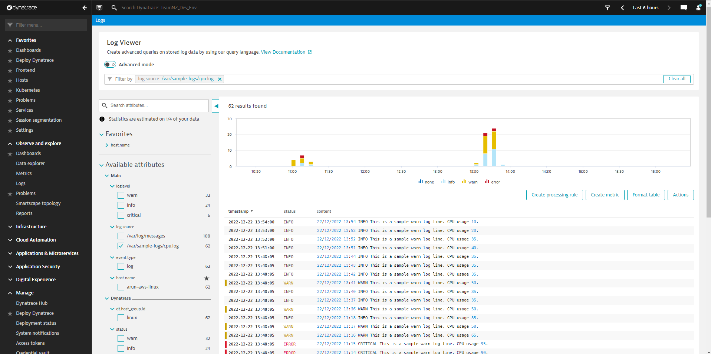
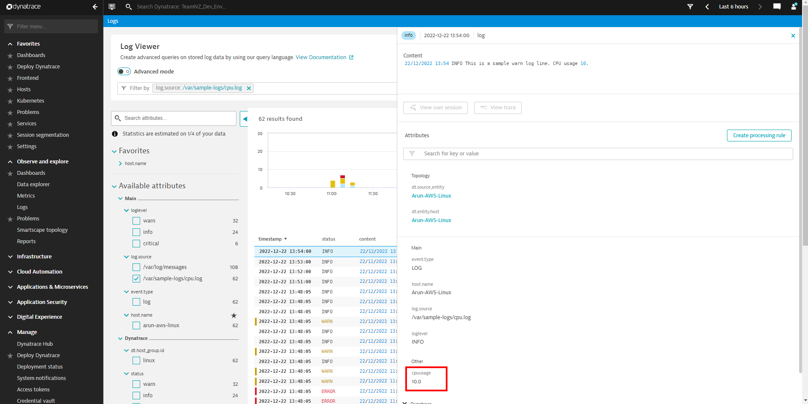
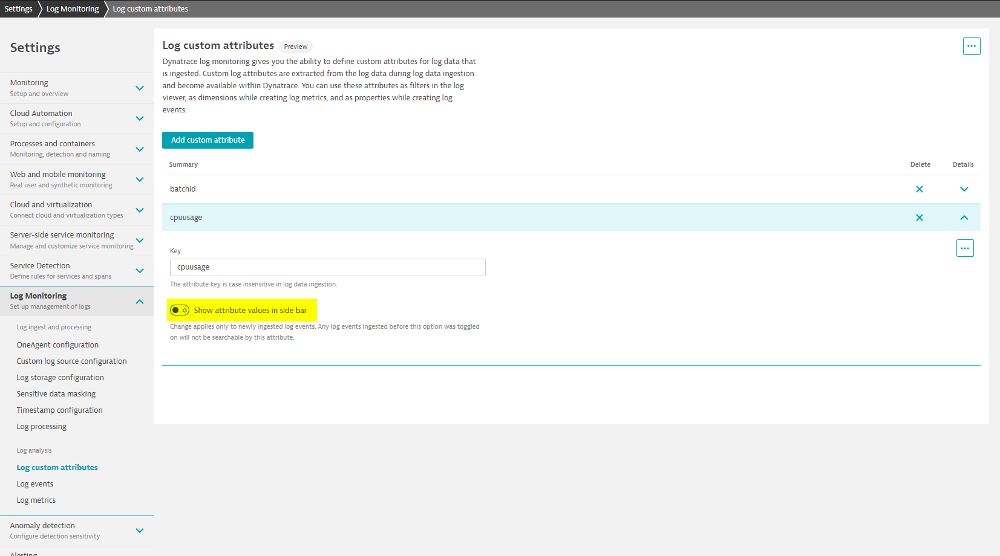

# 5. Log Data Analytics

This is the third main step of Dynatrace Log Monitoring. Once data is ingested and processed, it is available for viewing, creation of log events and log metrics and enrichment of traces (PurePaths).

Log Data Analytics step is where Dynatrace Log Monitoring capability diverges into Log Monitoring Classic (LQL) and Logs powered by Grail. 

> Log Monitoring Classic (LQL) is the common name for combined Log Monitoring 1.0 and Log Monitoring 2.0 capabilities and Logs powered by Grail is the latest and most advanced offering.

## Log Viewer

Log Viewer lists all the ingested log entries. From this page you can filter for insights using the `Filter` bar. 

The search Language for LQL is [Dynatrace Search Query Language](https://www.dynatrace.com/support/help/how-to-use-dynatrace/log-monitoring/analyze-log-data/log-viewer#sql) while the search language for Logs powered by Grail is [Dynatrace Query Language](https://www.dynatrace.com/support/help/shortlink/dql-dynatrace-query-language-hub)

> **Dynatrace Query Language (DQL)** and **Grail** brings huge advantages for log monitoring when compared to older Dynatrace Search Query language. 
> 
> Learn more about DQL here - [Dynatrace Query Language](https://www.dynatrace.com/support/help/shortlink/dql-dynatrace-query-language-hub)
> 

Clicking on a single log line opens it up in a pop-up view showing additional details including any fields (custom attributes) that were extracted during parsing. Image 5.2 highlights `cpuusage` custom attribute that was captured in [4.1-processor-rule-definition](4.1-processor-rule-definition.md).

Image 5.1 Log viewer

Image 5.2 Log line window

## Log Custom Attribute

As we have already seen in this course, Dynatrace provides the capability to capture values from log lines. We captured the custom attribute `cpuusage` in [4.1-processor-rule-definition](4.1-processor-rule-definition.md) when we setup the parsing rule for `cpu.log`.

Custom attributes can be shown as a filter option in Log Viewer by enabling highlighted switch (image 5.3) in `Settings > Log Monitoring > Log custom attributes`

Image 5.3 Custom attribute configuration

## Log Events

Events = Activity within the environment. 

Dynatrace AI engine classifies its observations within a monitoring environment into different event levels like 'Info', 'Custom', 'Error' and so on based on auto-baselines as well as fixed thresholds. 

In addition to AI engine, Dynatrace also allows custom events to be to sent to Dynatrace via API and Log Events.

> Docs: 
> - [Event types](https://www.dynatrace.com/support/help/shortlink/event-types)
> - [Events API](https://www.dynatrace.com/support/help/dynatrace-api/environment-api/events-v2)
> - [Log Events](https://www.dynatrace.com/support/help/how-to-use-dynatrace/log-monitoring/analyze-log-data/log-events)

A Log Event rule is a way of specifying if ingestion of a certain log entry should trigger additional action.

Below are the event types that can be triggered using Log Events
- Availability
- Custom alert
- Custom annotation
- Custom configuration
- Custom deployment
- Error
- Info
- Marked for termination
- Resource
- Slowdown

Some of these are meant as information only, for additional context, while others like Availability, Slowdown, Error, Resource and Custom Alert can be used to trigger problems (when matching log entry is ingested by Dynatrace). 

See [Activity: Log event](activities/activity-log-event.md) for an example log event setup.

While completing  the activity you may have noticed the limitation of Log Events for numerical values. The example log event requires that the `cpuvalue` be exactly `90` for the log event to trigger. This may not be ideal in real world cases. Therefore prefer Log Events for strings value and use Log Metrics when you need alerts based off numerical values.

Read more in Dynatrace doc - [Log events](https://www.dynatrace.com/support/help/how-to-use-dynatrace/log-monitoring/analyze-log-data/log-events)

## Log Metrics

Log Metric is the way to convert Log content into metrics that can be charted and alerted on.

Log Metrics can be created based on the `Occurence of log records`  (count) i.e. number of times a log entry appeared or on Custom Attribute values captured during log processing (like `cpuusage`).

See [activity-log-metric](activities/activity-log-metric.md) for an example log metric setup.

Read more in Dynatrace doc -[Log metrics](https://www.dynatrace.com/support/help/shortlink/log-monitoring-log-metrics)

 

### Next: [6. Log data alerting](6-log-data-alerting.md)

### Previous: [4. Log processing](4-log-processing.md)

