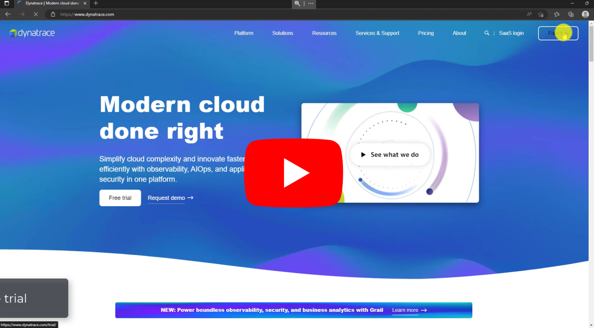

# Setup a lab environment
## Requirements:
- A Virtual Machine with below min configuration:
	- Windows OS (Recommended)
	- 2 vCPU
	- 4GB
	- 10GB dedicated Storage for Dynatrace
- Dynatrace tenancy
- [easyTravel installer](https://community.dynatrace.com/t5/Getting-started/easyTravel-Documentation-and-Download/td-p/181271)

## Steps:
1. Sign up for Dynatrace free trial (if you don't have an existing environment)
2. Install ActiveGate
3. Install OneAgent
4. Install easyTravel demo application
5. Install Microsoft VSCode (Optional) (Recommended)

## Dynatrace demo environment setup (Steps 1-4)

