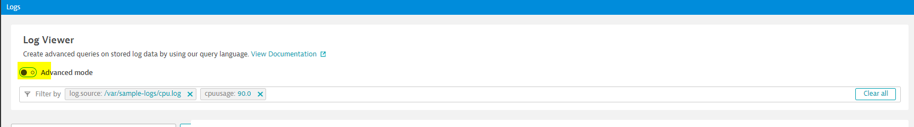
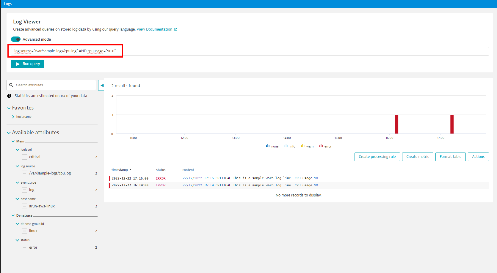
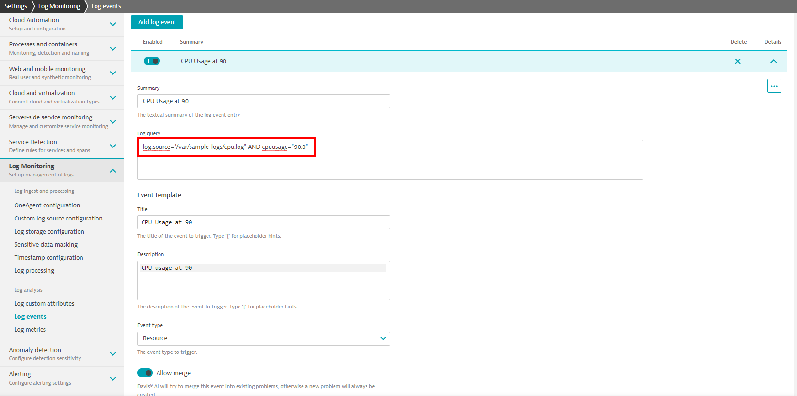
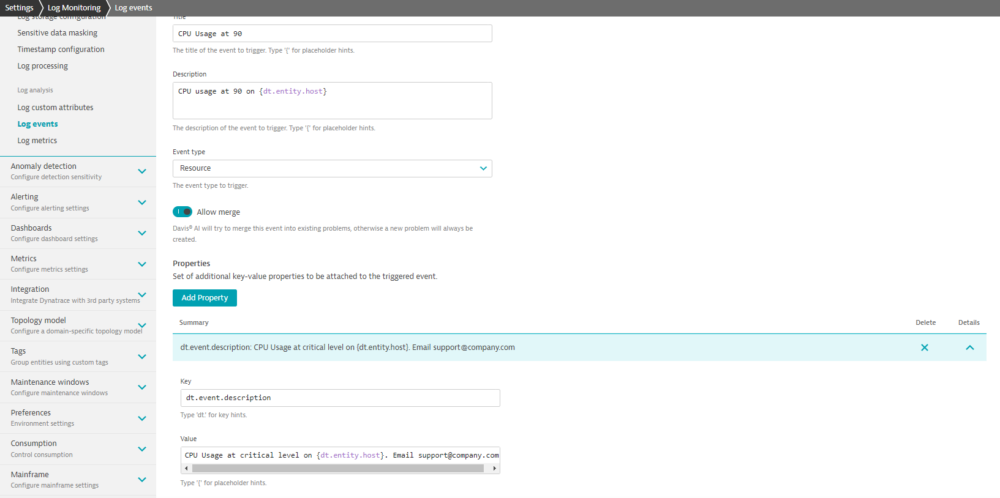
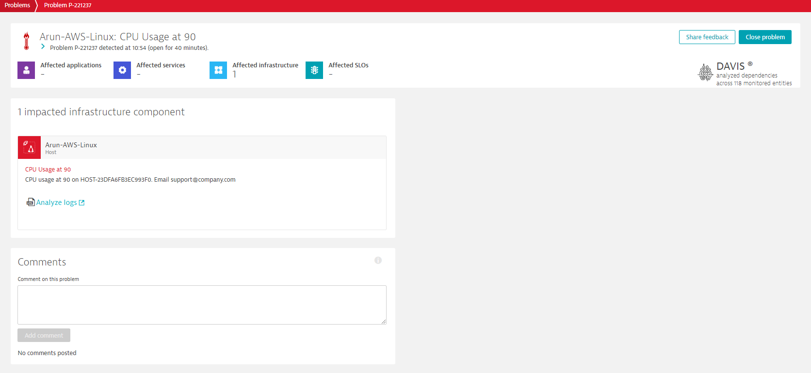

# Activity: Log Event Configuration


## Requirement:
Setup a Log Event that triggers a 'Resource' problem when `cpuusage` (custom attribute) value is at 90.

## Steps:

Navigate to `Settings > Log Monitoring > Log events` and click `Add log event`.

1. `Summary` field - Rule name
2. `Log query`
   
	The main field of a Log events rule is the `Log query` field. This tells Dynatrace what to look for to raise the event.
	
	The best way to put together the required `log query` is using Log Viewer. Within Log Viewer, filter for `cpuusage` at 90 log entries and then copy the query to use in Log Events `Log query` field.
	
	Linux:	`log.source="/var/sample-logs/cpu.log" AND cpuusage="90.0"`
	
	Windows: `log.source="C:\sample-logs\cpu.log" AND cpuusage="90.0"`


<p align="center">Image 5.4 Log Viewer search - basic mode</p>


<p align="center">Image 5.5 Log Viewer search - advanced mode</p>

3. Event Template - `Title` and `Description`

   Placeholders can be used in these fields. Get the list of available placeholders by typing `{`
   Example: `CPU usage at 90 on {dt.entity.host}`

4. Event Template -  `Event type`

   Select 'Resource' in `Event type` dropdown.


<p align="center">Image 5.6 Log Events configuration</p>
   
5. Properties 

   Provide additional context for the event using Properties. 
   Example:
   
   `Key`: `dt.event.description` (Note: this overrides the description provided in event template. This shows how the fields are related)

   `Value`: `CPU Usage at critical level on {dt.entity.host}. Email support@company.com`


<p align="center">Image 5.7 Log Events configuration</p>

6. Save changes

7. Add few `CRITICAL` lines to the sample log `/var/sample-logs/cpu.log`
   (Make sure to change timestamp to current time).

```log
23/12/2022 10:36 CRITICAL This is a sample warn log line. CPU usage 90.
23/12/2022 10:44 CRITICAL This is a sample critical log line. CPU usage 90.
23/12/2022 10:45 CRITICAL This is a sample critical log line. CPU usage 90.
23/12/2022 10:54 CRITICAL This is a sample warn log line. CPU usage 90.
```

> NOTE: You can see the limitation of Log Events for numerical values in this example. This log event requires that the `cpuvalue` be exactly `90` for the log event to trigger. This may not be ideal in real world cases. Therefore prefer Log Events for strings value and use Log Metrics for numerical values.

Next time a matching log entry comes in, 'Resource' problem is raised.


<br/>

### Back: [5. Log data analytics](../5-log-data-analytics.md)
