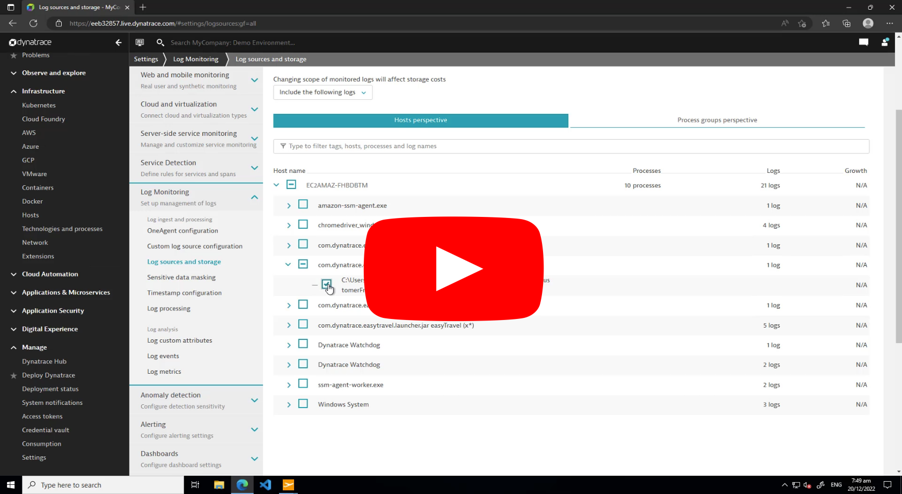

# Activity: Autodiscovery & log storage

> Note: Complete [activity-setup-a-lab-environment](activity-setup-a-lab-environment.md) before starting this activity.

Dynatrace auto discovers demo application easyTravel logs. This is possible as OneAgent can see logs being written by the processes (through existing instrumentation).

## Activity steps:
1. Verify easyTravel logs are being auto discovered
2. Enable log storage for a single log file
3. View logs in 'Log Viewer'

## Log Sources and Storage 

Below video shows auto discovered logs and enabling log storage for a single log in 'Log sources and storage' page.

1. Check Auto discovered logs in Dynatrace
2. Enable storage for an auto discovered log (easyTravel frontend)
3. Wait for data to show in Log Viewer
4. Check OneAgent logs

## Log Storage Configuration (Latest)

Below video shows enabling log storage in 'Log storage configuration' page.

> Note: Please complete [Manually added log file - log sources and storage](activity-log-ingestion-manually-added-files.md#Log%20Sources%20and%20Storage) steps (if you choose to) before upgrading to Log Storage configuration

1. Upgrade to Log Storage Configuration 
2. Create storage rule for ProcessGroups 
3. Check logs in Log Viewer 
4. Create store rule for log source
5. Check logs in Log Viewer
6. Check OneAgent logs

 

### Next: [Activity: Manually added log files & Log Storage](activity-log-ingestion-manually-added-files.md)

### Previous: [Activity: Setup a lab environment](activity-setup-a-lab-environment.md)

### Section home: [3.1 OneAgent](../3.1-oneAgent.md)

