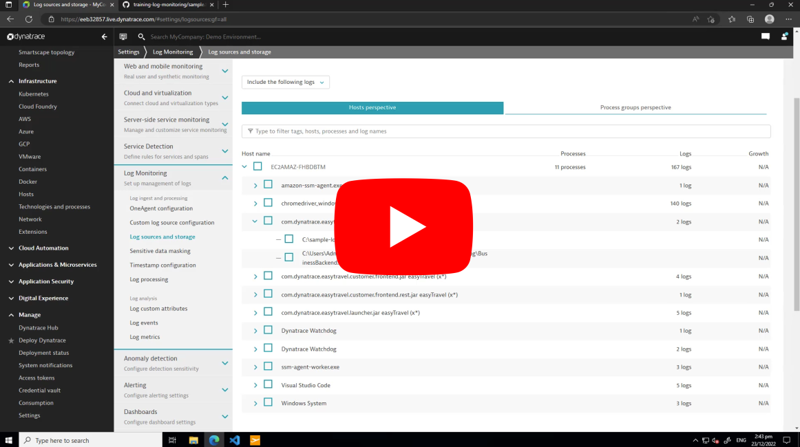

# Manually added log files & Log Storage

> Complete [activity-setup-a-lab-environment](activity-setup-a-lab-environment.md) before starting this activity.

Dynatrace provides the capability to manually add log files for ingestion if they are not auto discovered by OneAgent. In this activity we will test that capability.

## Activity steps:
1. Place sample logs on host - [Sample logs](https://github.com/dt-apac-services/training-log-monitoring/tree/main/sample-logs)
2. Setup rules for manual log file ingestion
3. Enable log storage for the manual log file
4. View logs in 'Log Viewer'

## Log Sources and Storage

Below video shows manually adding logs and enabling log storage for a single log file in 'Log Sources and Storage' page.

Steps:
1. Download sample logs -  [Sample logs](https://github.com/dt-apac-services/training-log-monitoring/tree/main/sample-logs)
2. Add log files to folders
   `C:\sample-logs\cpu.log`
   `C:\log\agent\sample\sample.txt` (This will present with an error. See if you can resolve it following [checklist-oneagent-manually-add-log-files](../checklists/checklist-oneagent-manually-add-log-files.md) checklist )
3. Add custom log file path using ProcessGroup setting (choose any ProcessGroup)
4. See if log shows in Log Storage
5. Enable log in Log Storage
6. Check OneAgent logs
7. Add new entries to log file with current timestamp
8. Wait for data to show in Log Viewer
9. Check OneAgent logs

## Log Storage Configuration

Below video shows manually adding logs and enabling log storage for a single log file in 'Log Storage Configuration' page.

Steps:
1. Download sample logs - [Microsoft HDInsight Sample Log File](https://www.microsoft.com/en-us/download/details.aspx?id=37003)
2. Add log files to folders
   `C:\log\agent\sample\sample.log`
   `C:\log\agent\actor\actors.txt` (This will present with an error. See if you can resolve it following [checklist-oneagent-manually-add-log-files](../checklists/checklist-oneagent-manually-add-log-files.md) checklist )
3. Add custom log file path using Host settings
4. Create storage rule for the manual log
5. Check OneAgent logs
6. Add new entries to log file with current timestamp
7. Wait for data to show in Log Viewer
8. Check OneAgent logs

<mark style="background: #FFE11C;">Video</mark> - Coming soon

### Previous: [Activity: Autodiscovery & Log Storage](activity-log-ingestion-autodiscovery.md)

### Section home: [3.1 OneAgent](../3.1-oneAgent.md)
