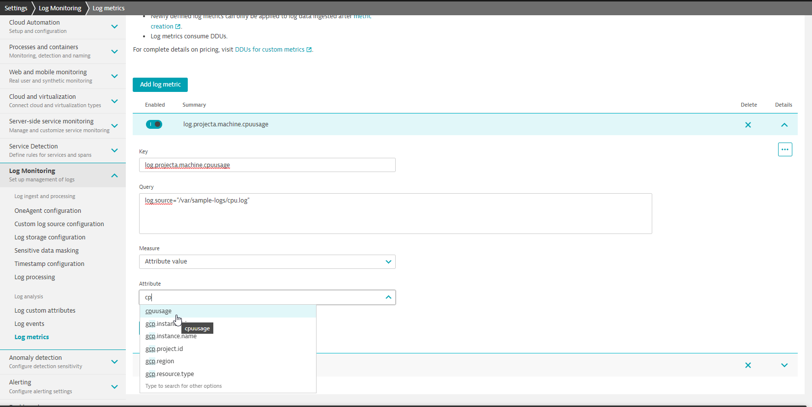
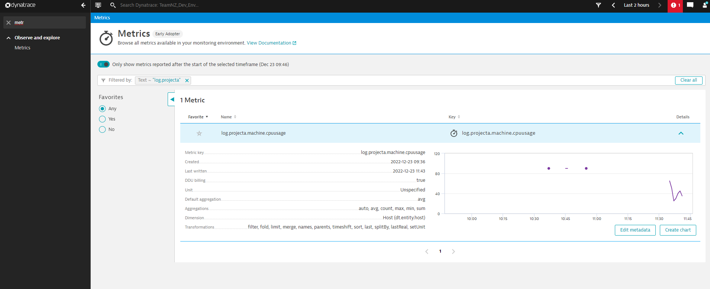

## Activity: Log metric configuration

## Requirement:
Setup a Log Metric for `cpuusage` custom attribute.

## Steps:

Navigate to `Settings > Log Monitoring > Log metics` and click `Add log metric`

1. `Key`
   Provide a unique key value that conveys the purpose of metric.
   `log.projecta.machine.cpuusage`
2. `Query`
   
   As with Log Events, `Query` is what tells Dynatrace where to capture the value.
   The best way to put together the required `Query` is using Log Viewer. Within Log Viewer, filter for `cpuusage` and then copy the query to use in Log metrics `Query` field.
   
   Linux: `log.source="/var/sample-logs/cpu.log"`
   Windows: `log.source="C:\sample-logs\cpu.log"`
3. `Measure`
   Select `Attribute value` from the dropdown as we want to capture `cpuusage` custom attribute value.
4. `Attribute`
   Select `cpuusage` custom attribute from the dropdown.
   
   
<p align="center">Figure 5.8 Log Metric configuration</p>
5. `Add Dimension`
   Add custom dimensions to the metric. 
   `dt.entity.host`
6. Save changes
7. Add more line to the sample log `/var/sample-logs/cpu.log` and save 
   (Make sure to change timestamp to current time).

```log
23/12/2022 11:20 INFO This is a sample info log line. CPU usage 20.
23/12/2022 11:21 INFO This is a sample info log line. CPU usage 25.
23/12/2022 11:22 WARN This is a sample warn log line. CPU usage 50.
23/12/2022 11:23 WARN This is a sample warn log line. CPU usage 60.
23/12/2022 11:24 WARN This is a sample warn log line. CPU usage 65.
```
The metric should now be available in the list of Dynatrace `Metrics` to chart or create `Metric events`.


<p align="center">Figure 5.9 Log Metric - Metrics </p>

<p align="center">Figure 5.10 Log Metric - Data Explorer </p>

<p align="center">Figure 5.11 Log Metric - Metric Events</p>
<br/>

### Back: [5. Log data analytics](../5-log-data-analytics.md)

